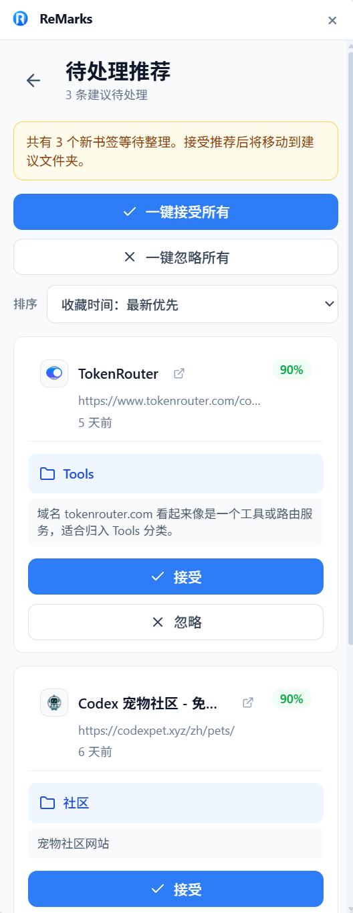

# ReMarks

> 一个由 AI 辅助分类、预览、移动和撤销整理浏览器书签的 Chrome/Edge 扩展。

## 📝 项目简介

ReMarks 面向书签长期堆积、手动整理成本高、分类结构难以维护的浏览器用户。它会读取浏览器书签树，结合本地规则与 OpenAI-compatible AI 服务生成分类建议，并在用户确认后才真正移动书签。

项目强调“用户确认优先”和“隐私最小化”：

- AI 只提供分类建议，不会静默移动、删除或批量改写书签。
- 整理前会保存书签备份，支持撤销最近一次整理。
- URL 默认去除 query/hash 后再发送给 AI，除非用户主动开启完整 URL。
- 浏览历史只用于本地计算常访问书签，不会发送给 AI，并且 `history` 是可选权限。

适用场景：

- 书签数量较多，希望快速梳理分类结构。
- 想在移动书签前逐条预览 AI 建议。
- 需要在 Chrome/Edge 中通过 popup、设置页或网页悬浮窗访问整理工具。
- 希望在新增书签时得到轻量分类推荐。

## 🖼️ 项目演示


| 待处理推荐 | 整理报告 |
| --- | --- |
|  |  |

## 📌 当前进度

项目当前已完成浏览器扩展的主要闭环：书签读取、AI 分类、分类习惯预设、整理前预览、确认后移动、整理报告、最近一次撤销、新增书签推荐、设置页和构建产物生成。

仍需继续完善的部分：

- 常访问书签目前是本地访问频次统计，不会自动生成移动方案。
- 目前没有单元测试、lint 或独立 typecheck 脚本，验证主要依赖 `npm run build` 和浏览器手动加载。
- 撤销能力只针对最近一次整理，不是完整历史版本管理。

## ✨ 核心功能

- [x] 书签树读取与选择：读取当前浏览器书签结构，支持按文件夹勾选要整理的书签。
- [x] AI 智能分类：通过 OpenAI-compatible HTTP API 获取分类路径、置信度、原因和 token 用量。
- [x] 整理前预览：按目标文件夹分组展示移动计划，确认前不会修改任何书签。
- [x] 确认后执行移动：复用或创建目标文件夹，逐条移动书签，并记录失败项。
- [x] 整理前备份与撤销：每次整理前保存备份，支持撤销最近一次整理。
- [x] 新增书签推荐：监听新增书签，生成待处理分类推荐，并支持接受、忽略和批量处理。
- [x] 常访问书签统计：可选启用 `history` 权限，仅在本地统计已收藏 URL 的访问频次。
- [x] 分类习惯预设：分析现有文件夹结构，提炼常用一级分类、文件夹规则、适用内容特征和给 AI 的预设提示，并支持保存和手动编辑。
- [x] 书签管理：支持搜索、新增、编辑、删除和拖拽移动书签。
- [x] 多入口体验：支持浏览器 popup、options 页面和网页悬浮 iframe。

## 🛠️ 技术栈

- 浏览器扩展：Manifest V3
- 前端框架：React 18 + TypeScript
- 构建工具：Vite
- 样式方案：Tailwind CSS v4 + 项目全局 CSS
- 状态管理：Zustand
- 路由：React Router
- UI 与图标：Radix UI、lucide-react
- 浏览器 API：`chrome.bookmarks`、`chrome.storage`、`chrome.permissions`、可选 `chrome.history`
- AI 接口：OpenAI-compatible HTTP API
- Provider 预设：OpenAI、DeepSeek、智谱 GLM、Kimi、Gemini、MiniMax、通义千问、豆包、自定义端点
- 包管理：pnpm

## 🚀 快速开始

### 环境要求

- Node.js 18+
- pnpm
- Chrome 或 Edge 浏览器

### 安装依赖

```bash
pnpm install
```

### 开发构建

```bash
# 监听模式，代码变化后自动重新构建扩展产物
npm run dev
```

### 生产构建

```bash
npm run build
```

构建产物会输出到 `dist/`，并通过 `scripts/copy-manifest.cjs` 生成可加载的 `dist/manifest.json`。

### 加载扩展

1. 打开 Chrome/Edge 扩展管理页：`chrome://extensions` 或 `edge://extensions`。
2. 开启“开发者模式”。
3. 点击“加载已解压的扩展程序”。
4. 选择项目根目录下的 `dist/` 文件夹。

### 配置 AI 服务

ReMarks 不使用 `.env` 文件保存 API Key。API Key 会通过设置页写入 `chrome.storage.local`。

1. 点击浏览器工具栏中的 ReMarks 图标。
2. 进入“设置”页面。
3. 选择 AI 提供商，或填写自定义 OpenAI-compatible endpoint。
4. 填写 API Key 和模型名称。
5. 点击“测试连接”确认配置可用。

## 📖 使用示例

### 整理现有书签

1. 打开 ReMarks popup。
2. 点击“开始智能整理”。
3. 在预览页勾选需要整理的书签或文件夹。
4. 等待 AI 生成分类建议。
5. 查看目标文件夹、置信度和分类原因。
6. 确认无误后点击“确认整理”。
7. 如需恢复，可在整理报告中撤销最近一次整理。

示例预览结果：

```text
React 官方文档
目标分类：开发 / 前端框架
置信度：0.95
原因：React 是前端开发框架相关站点
```

### 处理新增书签推荐

安装并配置扩展后，新增书签会进入待处理推荐列表。用户可以逐条接受推荐、忽略推荐，也可以批量处理所有待整理的新书签。接受推荐后，扩展会将该书签移动到建议文件夹。

### 查看常访问书签

在设置中启用常访问书签后，扩展会请求可选 `history` 权限，并只在本地统计已收藏 URL 的访问频次。目前该页面主要用于查看常访问的已收藏网页，不会把历史记录发送给 AI，也不会自动移动书签。

### 维护分类习惯预设

“分类习惯预设”页面会根据现有书签文件夹结构分析用户的分类命名、粒度和偏好。页面包含学习概览、常用一级分类、文件夹规则、避免规则和给 AI 的预设提示。

文件夹规则中的“适用内容特征”会总结该文件夹主要适合放置什么主题、什么类型的网页，并可附少量“标题（链接）”格式的参考。用户可以手动编辑这些规则并保存，后续智能分类会参考这些预设，让新分类更贴近已有文件夹命名和粒度。

### 管理本地书签

“管理书签”页面支持搜索、添加、编辑、删除和拖拽移动书签。删除书签属于直接浏览器书签操作，使用前需要在确认弹窗中再次确认。

## 🎯 项目亮点

- 用户主权：AI 只生成建议，所有书签移动都必须由用户明确确认。
- 隐私优先：默认发送脱敏 URL，浏览历史不发送给 AI，敏感权限按需申请。
- 可撤销整理：整理前保存完整书签树备份，降低误操作成本。
- 分类可控：支持嵌套层级、分类数量、完整 URL 开关、自定义 prompt 和分类习惯预设。
- 多场景入口：popup 适合快速整理，options 适合完整设置，悬浮窗适合网页内轻量操作。

## 📁 项目结构

```text
src/
  app/
    components/    页面组件：Popup、Options、Preview、Report、Recommendations 等
    services/      业务逻辑：bookmarks、organizer、aiProvider、storage、history 等
    store/         Zustand 全局状态
    types.ts       跨模块业务类型
    App.tsx        HashRouter 路由入口
  background/      Manifest V3 service worker
  content/         网页注入脚本与悬浮窗宿主
  popup/           popup 入口
  options/         options 页面入口
  styles/          Tailwind 入口与全局样式
scripts/           构建后处理和图标生成脚本
public/icons/      扩展图标资源
manifest.json      开发态扩展清单
```

## 🔮 未来计划

- [ ] 完善不同 AI Provider 的参数差异和错误提示。
- [ ] 增强书签重复检测与清理建议。
- [ ] 支持导入/导出分类规则。
- [ ] 增加定期整理提醒。
- [ ] 补充自动化测试覆盖核心整理流程。

## 🤝 贡献指南

欢迎提出 Issue 和 Pull Request。

## ❤ 感谢
感谢真诚 、友善 、团结 、专业的[LINUX DO](https://linux.do/latest)

## 📄 许可证

MIT License
