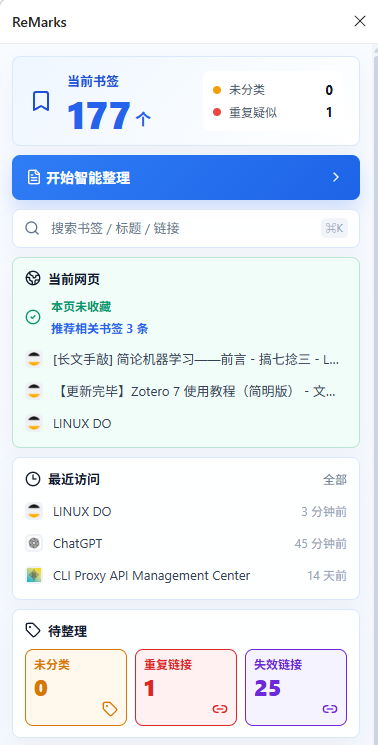
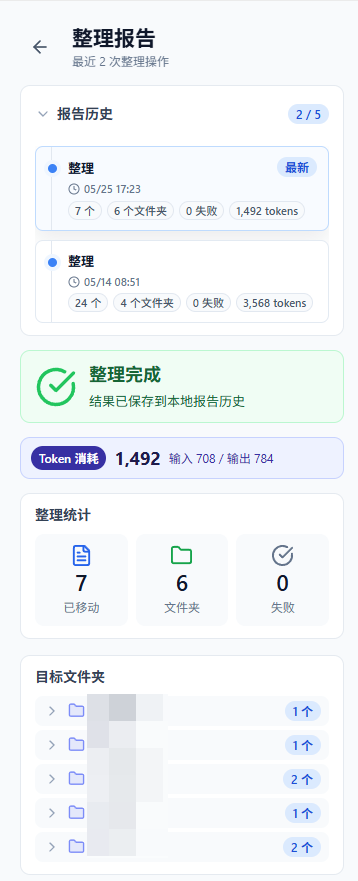
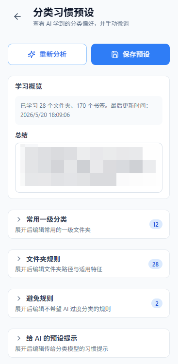
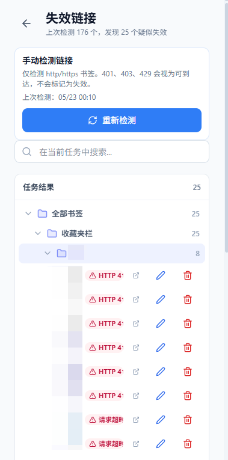

<div align="center">

# ReMarks

**AI 辅助的 Chrome / Edge 书签整理扩展**

先预览，再确认；整理前自动备份，把书签的最终决定权留给你。

[](https://github.com/waangzh/re-bookmarks/releases)


[核心能力](#-核心能力) · [安装](#-安装与体验) · [使用流程](#-使用流程) · [隐私与权限](#-隐私与权限) · [本地开发](#-本地开发) · [路线图](#-路线图)


</div>

## 为什么是 ReMarks

书签越多，整理成本越高；直接把批量移动交给 AI，又很难放心。

ReMarks 在两者之间提供了一条可控路径：读取浏览器书签树，结合本地规则、已有分类习惯与 OpenAI-compatible AI 服务生成建议；你可以先检查目标文件夹、置信度和原因，手动调整预览结果，确认后才会真正移动书签。

| 可控整理 | 安全回退 | 隐私最小化 |
| --- | --- | --- |
| AI 只生成建议，不会静默批量移动 | 整理、导入和批量删除前自动备份 | URL 默认移除 query/hash 后再发给 AI |
| 预览中可拖动书签调整目标分类 | 支持撤销或重新应用最近一次整理 | 浏览历史仅本地统计，且权限默认不开启 |
| 删除、恢复等敏感操作需要再次确认 | 最多保留 5 份近期备份并支持安全恢复 | API Key 仅保存在 `chrome.storage.local` |

## 🖼️ 界面预览

| 首页 | 整理报告 |
| --- | --- |
|  |  |

| 分类习惯预设 | 失效链接检测 |
| --- | --- |
|  |  |

## ✨ 核心能力

### AI 辅助整理

- 读取并按文件夹选择浏览器书签，支持快速整理与深度整理。
- 结合书签标题、域名、现有路径和可获取的网页元数据生成分类建议。
- 支持 OpenAI、DeepSeek、智谱 GLM、Kimi、Gemini、MiniMax、通义千问、豆包及自定义 OpenAI-compatible 端点。
- 每个 Provider 独立保存配置；整理前可查询、选择或手动输入本次使用的模型。
- 可限制一级分类数量、嵌套层级与子分类数量，并通过分类习惯预设保持命名和粒度一致。

### 预览、确认与报告

- 按目标文件夹展示移动计划、置信度、分类原因和 token 用量。
- 可在预览中长按拖动书签，手动修正 AI 建议；确认前不会改动书签。
- 确认后复用或创建目标文件夹，逐条移动并记录失败项。
- 保留最近 5 次整理报告；最新一次整理可撤销，也可在不重新调用 AI 的情况下重新应用。

### 日常书签维护

- 新增书签后生成待处理推荐，可编辑目标分类、接受、忽略或批量处理。
- 聚合待手动归档、重复链接和失效链接任务。
- 重复检测区分精确重复、忽略 query/hash 后的同路径疑似重复和标题相似疑似重复。
- 失效检测区分明确失效、可疑和暂时无法确认；401、403、429 不会被直接判定为失效。
- 支持搜索、新增、编辑、删除、拖拽移动书签，以及批量清理重复或失效项。
- 可选读取最近 90 天浏览历史，仅在本地统计已收藏 URL 的访问频次。

### 导入与备份

- 导入浏览器导出的 Netscape bookmarks HTML 文件，先预览，再写入新的导入文件夹。
- 自动跳过重复和无效条目，并保留原始目录层级。
- 整理、导入、恢复、重复删除和失效删除前创建保护点。
- 支持手动备份、查看近期备份和安全恢复；恢复前会再次备份当前状态。
- 安全恢复不会删除备份之后新增的书签。

## 🚀 安装与体验

### 从 Release 安装

1. 前往 [Releases](https://github.com/waangzh/re-bookmarks/releases) 下载最新的 `re-bookmarks-v*.zip`。
2. 解压压缩包。
3. 打开 `chrome://extensions` 或 `edge://extensions`。
4. 开启“开发者模式”，点击“加载已解压的扩展程序”。
5. 选择解压后包含 `manifest.json` 的文件夹。

> 仓库源码版本可能领先于最近一次 Release；需要体验最新功能时请从源码构建。

### 从源码构建

环境要求：

- Node.js 18+
- pnpm 10.25.0
- Chrome 或 Edge

```bash
git clone https://github.com/waangzh/re-bookmarks.git
cd re-bookmarks
pnpm install
npm run build
```

构建完成后，在扩展管理页加载项目中的 `dist/` 文件夹。

## 📖 使用流程

1. **配置 AI Provider**：打开设置页，选择服务商，填写 API Key、模型和 Endpoint，并测试连接。API Key 不会写入仓库、报告或备份。

2. **选择书签与整理模式**：从侧边栏进入智能整理，选择书签或文件夹。快速整理优先速度；深度整理会等待更多网页元数据。

3. **选择本次模型**：使用 Provider 返回的模型列表，或手动输入兼容模型。本次选择不会覆盖设置页的默认模型。

4. **检查并调整预览**：查看目标文件夹、置信度与原因；如有需要，可把书签拖到其他预览文件夹。

5. **确认执行**：ReMarks 先保存完整书签备份，再逐条执行移动。单项失败不会中断整批任务。

6. **查看报告或恢复**：在报告中查看移动结果和失败项；可撤销或重新应用最近一次整理，也可从备份页安全恢复。

```text
扫描书签 → 本地规则与习惯预设 → URL 脱敏 / 网页元数据
        → AI 分类建议 → 整理预览 → 用户调整并确认
        → 创建备份 → 执行移动 → 报告 / 撤销 / 重新应用
```

## 🔐 隐私与权限

### 会发送给 AI 的数据

分类请求可能包含书签标题、域名、现有文件夹路径、URL，以及深度整理时获取到的页面标题、描述等元数据。

- 默认情况下，URL 会移除 query 和 hash。
- 只有主动开启“发送完整 URL”后，才会发送完整 URL。
- 浏览历史不会进入 AI 请求。
- 实际数据还会受所选 AI Provider 的隐私政策约束，请使用你信任的服务。

### 浏览器权限说明

| 权限 | 用途 |
| --- | --- |
| `bookmarks` | 读取书签树，以及在确认后创建文件夹、移动、编辑、删除或恢复书签 |
| `storage` | 在本地保存设置、推荐、预览任务、报告和备份 |
| `activeTab` | 在侧边栏显示当前网页是否已收藏及相关书签 |
| `favicon` | 显示书签网站图标 |
| `sidePanel` | 点击扩展图标时打开 ReMarks 侧边栏 |
| `<all_urls>` | 请求自定义 AI 端点、读取网页元数据和执行失效链接检测 |
| `history`（可选） | 用户主动开启后，仅在本地统计常访问的已收藏网页 |

`history` 保持为 optional permission：未开启常访问书签时不会请求，拒绝授权也不影响核心整理功能。

## ⚙️ AI Provider

内置 Provider 预设会自动处理常见 Endpoint、temperature、token 参数名与 JSON mode 差异，也可以使用自定义 OpenAI-compatible 服务。

| Provider | 配置项 |
| --- | --- |
| OpenAI / DeepSeek / 智谱 GLM / Kimi | API Key、模型、Endpoint 与高级参数 |
| Gemini / MiniMax / 通义千问 / 豆包 | 对应兼容端点、模型与 Provider 参数适配 |
| Custom | 自定义 OpenAI-compatible Endpoint、模型及请求参数 |

如果未配置 API Key，浏览、管理、导入、备份等本地功能仍可使用，但无法生成 AI 分类建议。

## 🛠️ 本地开发

```bash
# 监听源码变化并持续重建
npm run dev

# 生产构建，同时生成可加载的 dist/manifest.json
npm run build
```

监听构建不会自动刷新浏览器中的扩展，代码变化后需要在扩展管理页点击“重新加载”。

项目当前没有独立的 lint、typecheck 或单元测试脚本；代码变更至少应通过 `npm run build`，涉及界面时还应手动检查 360px 紧凑布局、侧边栏和设置页。

### 技术栈

- Manifest V3
- React 18 + TypeScript
- Vite 6 + Tailwind CSS v4
- Zustand + React Router
- Radix UI + lucide-react
- `chrome.bookmarks`、`chrome.storage`、`chrome.permissions`、可选 `chrome.history`

### 项目结构

```text
src/
  app/
    components/    页面组件：整理、报告、推荐、备份、导入、书签管理等
    services/      书签、AI、规则、整理、备份、历史和存储等业务逻辑
    store/         Zustand 全局状态
    types.ts       跨模块业务类型
    App.tsx        popup、side panel 与 options 共用路由
  background/      Manifest V3 service worker
  popup/           360px 紧凑页面入口
  sidebar/         浏览器侧边栏入口
  options/         设置页入口
  styles/          Tailwind 入口与全局样式
scripts/           Manifest 后处理与图标生成脚本
public/icons/      扩展图标
manifest.json      开发态扩展清单
```

## 📌 当前状态与限制

- 当前源码版本为 `1.7.0`，核心的“建议 → 预览 → 备份 → 确认执行 → 报告/恢复”闭环已可用。
- AI 结果可能不准确，尤其是标题含糊或页面元数据不可访问时；请始终检查预览。
- 深度整理单次最多建议选择 100 个书签；快速整理建议单次不超过 300 个，较大书签库应按文件夹分批处理。
- 撤销与重新应用只针对最新一次整理；历史报告仅用于查看。备份页另保留最近 5 个保护点，可用于安全恢复。
- 失效链接检测受网络、登录状态、反爬和限流影响，“可疑”或“暂时无法确认”不等于链接已经失效。
- 数据主要保存在 `chrome.storage.local`；卸载扩展或清空扩展存储前，请先确认不再需要本地报告和备份。

## 🔮 路线图

近期版本已经补齐 Provider 参数兼容、整理模型选择、书签 HTML 导入、备份恢复、重复/失效批量清理和手动归档忽略。

下一阶段计划：

- [ ] 持续完善不同 AI Provider 的模型发现、参数差异和错误提示。
- [ ] 支持分类习惯与规则的导入、导出。
- [ ] 增加可选的定期整理提醒。
- [ ] 补充关键 service 的自动化测试与独立类型检查。

路线图不代表固定发布时间，欢迎在 [Issues](https://github.com/waangzh/re-bookmarks/issues) 中讨论优先级。

## 🤝 参与贡献

欢迎提交 [Issue](https://github.com/waangzh/re-bookmarks/issues) 或 [Pull Request](https://github.com/waangzh/re-bookmarks/pulls)。

提交代码前请：

1. 从 `master` 创建功能分支。
2. 保持修改范围聚焦，不提交 `dist/`、`.env*`、日志或真实 API Key。
3. 运行 `npm run build`。
4. 涉及书签移动、删除、权限或隐私边界时，在 PR 中说明手动验证场景。

## ❤ 感谢

感谢真诚、友善、团结、专业的 [LINUX DO](https://linux.do/latest) 社区。

## 📄 许可证

MIT License
